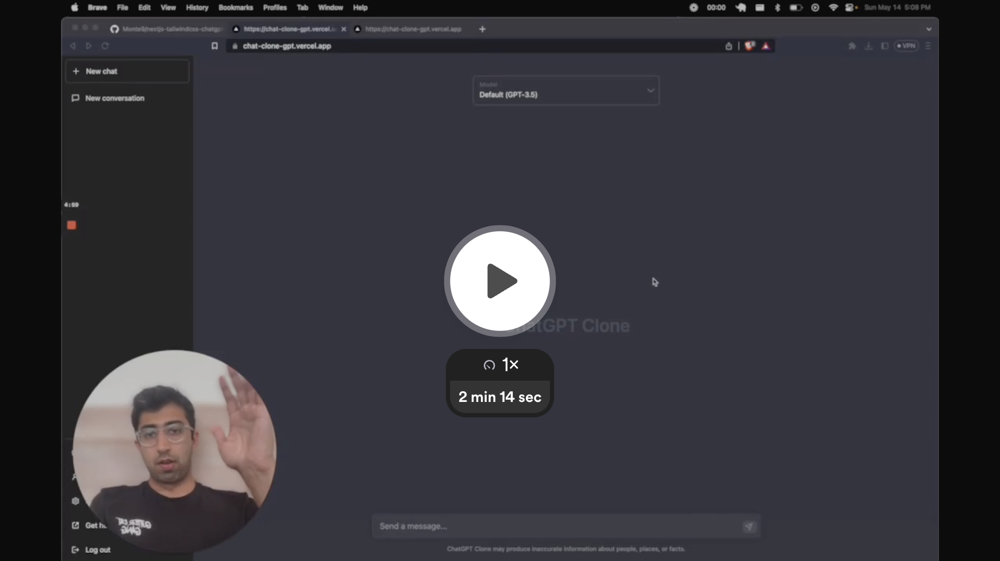

# ChatGPT Clone

Gemini Clone is a fully functional clone of ChatGPT UI, an AI-powered chatbot, built using Next.js and Tailwind CSS. It allows users to have interactive conversations with the chatbot, powered by the Google gemini-pro and gemini-pro-vision language model.

**Try it now:** https://gemini-chatbot-willians-projects-9b480e07.vercel.app

<!-- 🎥 **Watch the Demo Video**

 -->

## Technology Choices

ChatGPT Clone utilizes the following technologies:

| Technology       | Version |
| ---------------- | ------- |
| Next.js          | 13.3.0  |
| Tailwind CSS     | 3.3.1   |
| React            | 18.2.0  |
| TypeScript       | 5.0.4   |
| Axios            | 1.3.5   |
| dotenv           | 16.0.3  |
| mixpanel-browser | 2.46.0  |
| uuid             | 9.0.0   |

## Getting Started

To get started with ChatGPT Clone, follow these steps:

1. Clone this repository
2. Install the dependencies: `yarn`
3. Set up your environment variables by creating a `.env` file and adding the necessary values.
4. Run the development server: `yarn dev`
5. Open [http://localhost:3000](http://localhost:3000) in your browser to see the application.

## Contributing

Contributions are welcome! If you find ChatGPT Clone useful, consider starring the repository on GitHub.

## License

This project is open source and available under the [MIT License](https://opensource.org/licenses/MIT).
